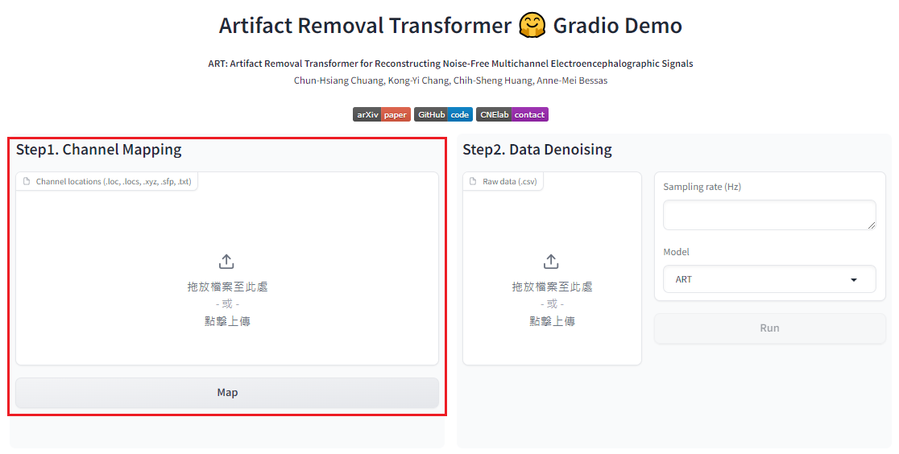
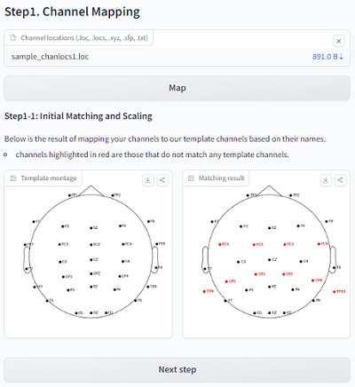
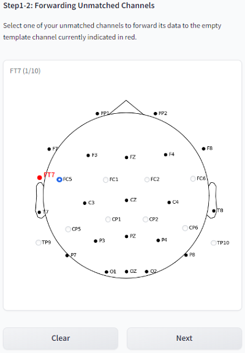
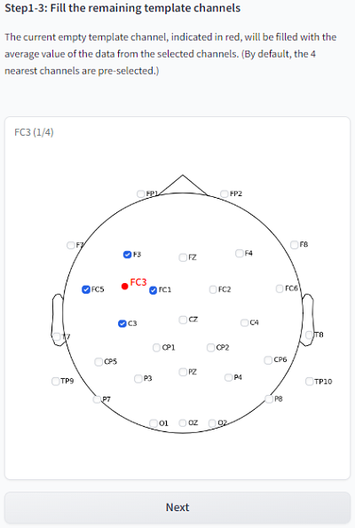
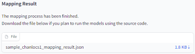

# Artifact Removal Transformer (ART)
This study introduces the Artifact Removal Transformer (ART), a novel EEG denoising model that employs transformer architecture to effectively handle multichannel EEG data. ART is specifically designed to capture the millisecond-scale transient dynamics inherent in EEG, providing a comprehensive, end-to-end solution for denoising various types of artifacts. This advancement builds on our previous enhancement of the IC-U-Net model, which now includes positional encoding and self-attention mechanisms to significantly improve signal reconstruction capabilities. To train these models, we refined the generation of noisy-clean EEG data pairs using an independent component analysis approach, creating robust training scenarios essential for supervised learning.

🤗 [Artifact Removal Transformer](https://huggingface.co/spaces/CNElab/ArtifactRemovalTransformer)


> **ART: An Artifact Removal Transformer for Reconstructing Noise-Free Multi-Channel EEG Signals** [[arXiv paper](https://arxiv.org/abs/2409.07326)]<br>
> Chun-Hsiang Chuang, Kong-Yi Chang, Chih-Sheng Huang, Anne-Mei Bessas<br>
> [CNElab](https://sites.google.com/view/chchuang/)<br>

# Installation
1. Clone the repository

```sh
git clone https://github.com/CNElab-Plus/ArtifactRemovalTransformer.git
```

2. Download **checkpoints**: you need to download the 'ART', 'ICUNet', 'ICUNet_attn', 'ICUNet++', respectivily. Then move these folder to under the `./model` folder.
[Google drive link](https://drive.google.com/drive/folders/1ahbqcyBs6pwfWHaIf_N978DZD-JmGQJg?usp=sharing)

3. Create a virtual environment and install the required packages (tested with Python 3.12.4 on Windows):

```sh
python -m venv ART
Set-ExecutionPolicy -Scope Process -ExecutionPolicy Bypass
ART\Scripts\Activate.ps1
pip install torch==2.2.0 torchvision==0.17.0 torchaudio==2.2.0 --index-url https://download.pytorch.org/whl/cpu
pip install scipy
```
> we don't need `requirements.txt`

# Usage Guide

## Data Specification
- Your data must be a two-dimensional array (channels, timepoints) and should be converted into `.csv` format.
- All reference, ECG, EOG, EMG, or other non-EEG channels must be removed from both your data and channel location file.

## Channel Mapping
1. Go to our [Hugging Face space](https://huggingface.co/spaces/CNElab/ArtifactRemovalTransformer) and complete the process of **Step1. Channel Mapping**.
    <br>
    (For detailed instructions, please refer to the user guide.)
    <details>
    <summary>Example</summary>

    <br>
    <br>
    <br>
    <br>
    </details>

2. After finishing the process, download the generated `XXX_mapping_result.json` file.

3. Modify the mapping file name in `main.py`
```python
mapping_name = './sampledata/sample_chanlocs_mapping_result.json'
```

## Inference
1. Check parameters in `main.py`
```sh
input_path = './sampledata/'
input_name = 'sampledata.csv'
sample_rate = 256 # input data sample rate
modelname = 'ART' # or 'ICUNet', 'ICUNet++', 'ICUNet_attn', 'ART'
output_path = './sampledata/'
output_name = 'outputsample.csv'
```
2. Run the code
```sh
python .\main.py
```

### Batch processing
For batch processing, wrap the code in `main.py` in a for loop.<br>
Here is an example:
```python
for idx in range(num_data):
    # Wrap the name in a for loop
    input_name  = 'raw_{:03d}.csv'.format(idx)
    output_name = 'reconstruct_{:03d}.csv'.format(idx)

    for i in range(num_group):

        # step1: Data preprocessing
        preprocess_data = utils.preprocessing(input_path+input_name, sample_rate, mapping_result[i])
        # step2: Signal reconstruction
        reconstruct_data = utils.reconstruct(modelname, preprocess_data, output_name, i)
        # step3: Data postprocessing
        utils.postprocessing(reconstruct_data, sample_rate, output_path+output_name, mapping_result[i], i, num_channel)

```

# Citation
[1] C.-H. Chuang, K.-Y. Chang, C.-S. Huang, and T.-P. Jung, "[IC-U-Net: A U-Net-based denoising autoencoder using mixtures of independent components for automatic EEG artifact removal](https://www.sciencedirect.com/science/article/pii/S1053811922007017)," NeuroImage, vol. 263, p. 119586, 2022/11/01/ 2022 <br>
[2]  K. Y. Chang, Y. C. Huang, and C. H. Chuang, "[Enhancing EEG Artifact Removal Efficiency by Introducing Dense Skip Connections to IC-U-Net](https://ieeexplore.ieee.org/document/10340520)," in 2023 45th Annual International Conference of the IEEE Engineering in Medicine & Biology Society (EMBC), 24-27 July 2023 2023, pp. 1-4