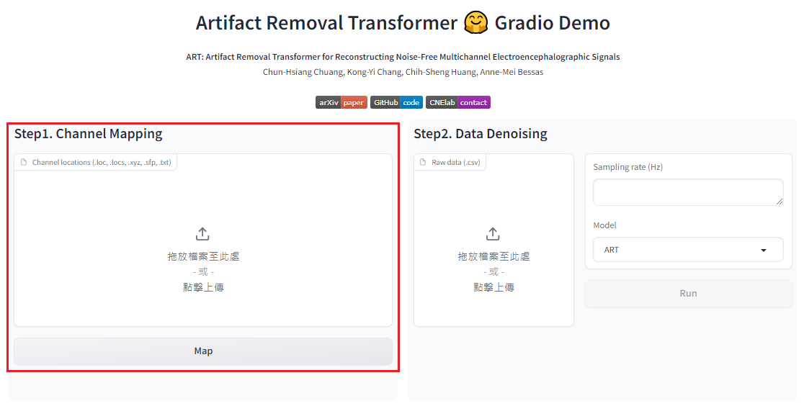

# Artifact Removal Transformer (ART)

This study introduces the Artifact Removal Transformer (ART), a novel EEG denoising model that employs transformer architecture to effectively handle multichannel EEG data. ART is specifically designed to capture the millisecond-scale transient dynamics inherent in EEG, providing a comprehensive, end-to-end solution for denoising various types of artifacts. This advancement builds on our previous enhancement of the IC-U-Net model, which now includes positional encoding and self-attention mechanisms to significantly improve signal reconstruction capabilities. To train these models, we refined the generation of noisy-clean EEG data pairs using an independent component analysis approach, creating robust training scenarios essential for supervised learning.

🤗 [Artifact Removal Transformer on Hugging Face](https://huggingface.co/spaces/CNElab/ArtifactRemovalTransformer)

> **ART: An Artifact Removal Transformer for Reconstructing Noise-Free Multi-Channel EEG Signals** [[arXiv paper](https://arxiv.org/abs/2409.07326)]<br>
> Chun-Hsiang Chuang, Kong-Yi Chang, Chih-Sheng Huang, Anne-Mei Bessas<br>
> [CNElab](https://sites.google.com/view/chchuang/)<br>

---

## Project layout

```
ART_ArtifactRemovalTransformer/
├── main.py                       # Offline inference entry point
├── art/                          # Inference-time Python package
│   ├── __init__.py               #   Public API: preprocessing / reconstruct / postprocessing / DEVICE
│   ├── device.py                 #   CUDA → MPS → CPU auto-detection
│   ├── inference.py              #   Signal-processing + model-forward pipeline
│   └── models/                   #   Model definitions
│       ├── transformer.py        #     ART (encoder-decoder transformer)
│       ├── transformer_data.py   #     Batch helper
│       ├── icunet.py             #     IC-U-Net (UNet1)
│       ├── icunet_pp.py          #     IC-U-Net++ (NestedUNet3)
│       └── icunet_attn.py        #     IC-U-Net + attention (UNetpp3_Transformer)
├── training/                     # Training scripts (independent of inference path)
│   ├── train_art.py              #   ART supervised training
│   ├── train_art_simple.py       #   Minimal ART training loop
│   ├── pretrain_art.py           #   ART self-supervised pretraining
│   ├── train_icunet.py           #   IC-U-Net / IC-U-Net++ / IC-U-Net_attn trainer
│   ├── datasets_art.py           #   myDataset + preDataset for ART
│   ├── datasets_icunet.py        #   myDataset for IC-U-Net family
│   ├── losses_art.py             #   Transformer loss + label smoothing
│   ├── losses_icunet.py          #   Multi-term MSE losses for U-Nets
│   ├── optim.py                  #   Noam learning rate schedule
│   ├── plot_helpers.py           #   matplotlib / seaborn helpers + save_checkpoint
│   ├── utils.py                  #   SNR / PSD / partial_channel helpers
│   ├── make_fake_data.py         #   Generate synthetic data for smoke tests
│   ├── smoke_train.py            #   1-batch test of every trainer
│   └── matlab/                   #   Original MATLAB preprocessing helpers
├── notebooks/                    # Exploratory Jupyter notebooks
├── gradio/                       # Hugging Face Space deployment code
├── sampledata/                   # 63-channel sample EEG + channel-mapping JSON
├── image/                        # README assets
├── checkpoints/                  # ← put downloaded weights here (gitignored)
└── requirements.txt
```

---

## 1. Installation

Tested on macOS (Apple Silicon, MPS) and Linux (CPU). The same code automatically uses CUDA when available.

```bash
# Clone
git clone https://github.com/CNElab-Plus/ArtifactRemovalTransformer.git
cd ArtifactRemovalTransformer

# Create an environment (any of these works)
conda create -n ART python=3.10 && conda activate ART
# -- or --
python -m venv .venv && source .venv/bin/activate

# Install deps
pip install -r requirements.txt
```

If you want CPU-only PyTorch on Linux/Windows (smaller install):

```bash
pip install torch --index-url https://download.pytorch.org/whl/cpu
pip install -r requirements.txt
```

Verify the install:

```bash
python -c "import torch; print('torch', torch.__version__, 'cuda', torch.cuda.is_available(), 'mps', torch.backends.mps.is_available())"
```

---

## 2. Inference (denoising your EEG)

### 2.1 Download checkpoints

Download the pre-trained weights from [Google Drive](https://drive.google.com/drive/folders/1ahbqcyBs6pwfWHaIf_N978DZD-JmGQJg?usp=sharing) and lay them out as follows:

```
checkpoints/
├── ART/modelsave/checkpoint.pth.tar
├── ICUNet/modelsave/checkpoint.pth.tar
├── ICUNet++/modelsave/checkpoint.pth.tar
└── ICUNet_attn/modelsave/checkpoint.pth.tar
```

You only need the ones you intend to run (defaults to `ART`).

### 2.2 Channel mapping

Each model is trained on a fixed 30-channel template. Your EEG may have a different montage, so you first need a mapping file.

1. Open the [Hugging Face Channel-Mapping tool](https://huggingface.co/spaces/CNElab/ArtifactRemovalTransformer) and complete **Step 1. Channel Mapping**.
   
2. Download the generated `*_mapping_result.json`.
3. Place it next to your data, e.g. `./mydata/mapping.json`.

A sample mapping is provided at [sampledata/sample_chanlocs_mapping_result.json](sampledata/sample_chanlocs_mapping_result.json) so you can run inference immediately.

### 2.3 Run inference

The simplest way is to edit the parameters at the top of [main.py](main.py) and run it:

```python
input_path = './sampledata'
input_name = 'sampledata.csv'
sample_rate = 256
modelname = 'ART'                  # or 'ICUNet', 'ICUNet++', 'ICUNet_attn'
output_path = './sampledata'
output_name = 'outputsample.csv'
mapping_name = './sampledata/sample_chanlocs_mapping_result.json'
```

Then:

```bash
python main.py
```

Expected output (on Apple Silicon):

```
[INFO] device = mps
[INFO] model  = ART
[INFO] input  = ./sampledata/sampledata.csv
[INFO] output = ./sampledata/outputsample.csv
[INFO] groups = 3 / channels = 63
Using ART model to reconstruct outputsample-1 has been success in 0.7 sec(s)
...
[DONE] Reconstructed signal saved to ./sampledata/outputsample.csv
```

### 2.4 Programmatic API

If you'd rather call ART from your own script, the public functions live on the `art` package:

```python
import art

mapping, num_channel, num_group = art.read_mapping_result('mapping.json')
for i in range(num_group):
    windows = art.preprocessing('my_eeg.csv', sample_rate=256, mapping_result=mapping[i])
    cleaned = art.reconstruct('ART', windows, 'output.csv', i)
    art.postprocessing(cleaned, 256, 'output.csv', mapping[i], i, num_channel)
```

### 2.5 Input data spec

- 2-D CSV: `(channels × timepoints)`. Comma separated, no header.
- Remove reference / ECG / EOG / EMG / non-EEG channels before running.
- The pipeline resamples to 256 Hz internally, then bandpasses 1–50 Hz, then chunks into 4-second windows (1024 samples).

---

## 3. Training

Training is independent from inference. The published checkpoints were produced on GPUs over days; on a Mac this is mainly useful as a smoke test rather than a from-scratch reproduction.

### 3.1 Quick smoke test (no real data needed)

Verify every trainer (forward / backward / checkpoint) works end-to-end with synthetic data:

```bash
python training/make_fake_data.py   # writes ./Real_EEG and ./MetaPreTrain (~10s, ~50MB)
python training/smoke_train.py      # exercises all four trainers (~10s)
```

Expected ending:

```
========== summary ==========
  train_art_simple          OK
  train_art                 OK
  pretrain_art              OK
  train_icunet              OK
```

Clean up afterwards if you don't need it:

```bash
rm -rf Real_EEG MetaPreTrain smoke_*
```

### 3.2 Real training data layout

The four trainers expect data in the same layout as the published experiments:

```
Real_EEG/
├── train/
│   ├── Brain/         seg_*.csv      # (30, 1024) clean EEG segments
│   ├── ChannelNoise/  seg_*.csv      # noisy versions of the same segments
│   ├── Eye/           seg_*.csv
│   ├── Heart/         seg_*.csv
│   ├── LineNoise/     seg_*.csv
│   ├── Muscle/        seg_*.csv
│   └── Other/         seg_*.csv
├── test/  (same 7 subdirs)
└── val/   (same 7 subdirs)
```

For pretraining, additionally:

```
MetaPreTrain/
├── Hyperscanning_navigation/3_ICA/ *.csv
├── Hyperscanning_slapjack/3_ICA/  *.csv
└── Lane_keeping/3_ICA/            *.csv
```

The noisy / clean pairs are generated via ICA (see the paper, Section II.B). The MATLAB helpers under [training/matlab/](training/matlab/) replicate that pipeline.

### 3.3 Run a trainer

Use `python -m` so the `art` and `training` packages resolve correctly:

```bash
# ART (supervised, single-fold)
python -m training.train_art

# ART (self-supervised pretraining + supervised fine-tune)
python -m training.pretrain_art

# IC-U-Net / IC-U-Net++ / IC-U-Net_attn — choose by editing model_train_parameter.model
python -m training.train_icunet
```

All checkpoints are written under `<save>/modelsave/checkpoint.pth.tar` where `<save>` is configured at the top of each script (default: `./0909_RealEEG`, `./0928_RealEEG`, etc.).

> **Tip — Mac users.** The trainers will run on MPS, but full training of the 128-d ART transformer takes days on a single GPU; expect proportionally slower on Apple Silicon. Use the smoke test (§3.1) to validate the pipeline, then run real training on a CUDA box.

---

## 4. Hugging Face Space

The `gradio/` folder contains the deployment code used by the public Space. Run locally with:

```bash
pip install -r gradio/requirements.txt
python gradio/app.py
```

---

## Citation

[1] C.-H. Chuang, K.-Y. Chang, C.-S. Huang, and T.-P. Jung, "[IC-U-Net: A U-Net-based denoising autoencoder using mixtures of independent components for automatic EEG artifact removal](https://www.sciencedirect.com/science/article/pii/S1053811922007017)," *NeuroImage*, vol. 263, p. 119586, 2022.

[2] K.-Y. Chang, Y.-C. Huang, and C.-H. Chuang, "[Enhancing EEG Artifact Removal Efficiency by Introducing Dense Skip Connections to IC-U-Net](https://ieeexplore.ieee.org/document/10340520)," in *EMBC 2023*, pp. 1–4.

[3] C.-H. Chuang et al., "[ART: An Artifact Removal Transformer for Reconstructing Noise-Free Multi-Channel EEG Signals](https://arxiv.org/abs/2409.07326)," 2024.
